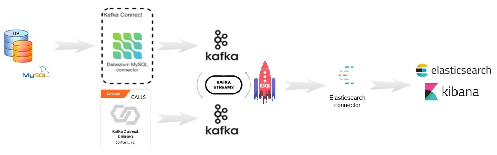

# Demo Rosetta Unlimited

Demonstration of the use of technologies related to data streaming processing.
- [Apache Kafka](https://kafka.apache.org/)
- [Confluent Platform](https://www.confluent.io//)
- [Debezium Connector](https://debezium.io/documentation/reference/1.3/connectors/mysql.html/)
- [Kafka Connect Datagen](https://www.confluent.io/hub/confluentinc/kafka-connect-datagen/)
- [Kafka Streams](https://kafka.apache.org/documentation/streams/)
- [KsqlDB](https://ksqldb.io/)
- [MySQL](https://www.mysql.com/)

## Architecture



## Prerequisites

- [Install Confluent Platform](https://docs.confluent.io/current/installation/index.html//)
- Create the MySQL database and tables according to the script: mysql-rosetta-setup.sql


## Project execution
```console
foo@bar:~$ ./setup-demo-customers
foo@bar:~$ ./setup-demo-customers ksql
foo@bar:~$ ./setup-demo-calls.sh
foo@bar:~$ ./setup-demo-calls.sh ksql
foo@bar:~$ ./setup-demo-calls-customers.sh
```

You can delete the current file by clicking the **Remove** button in the file explorer. The file will be moved into the **Trash** folder and automatically deleted after 7 days of inactivity.

## Checks

You can check the result with:
```console
foo@bar:~$ kafka-avro-console-consumer --bootstrap-server localhost:9092 --topic CALLS_CLIENTES_ENR --from-beginning
```

### Dashboard

